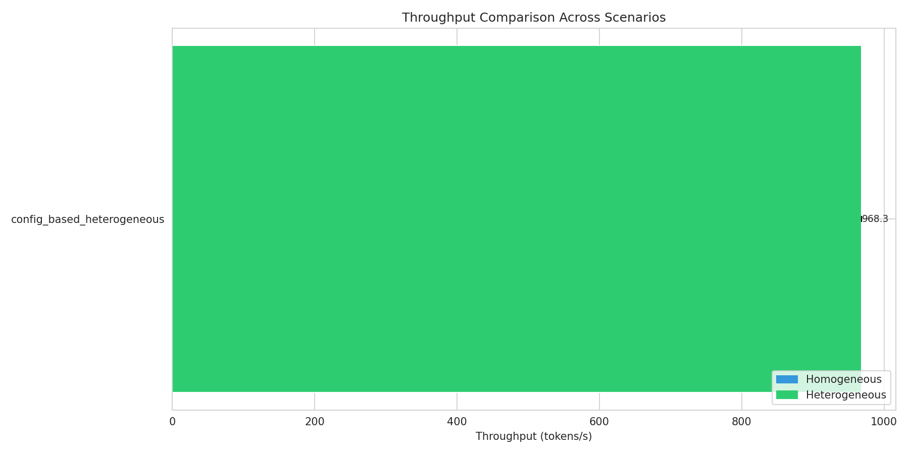
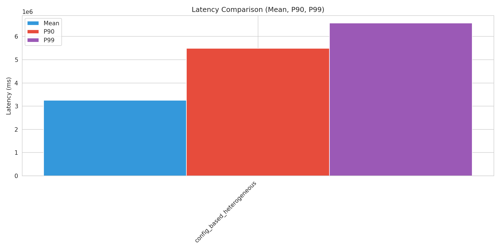
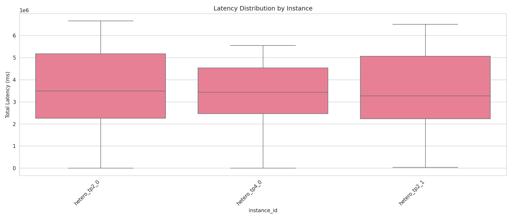
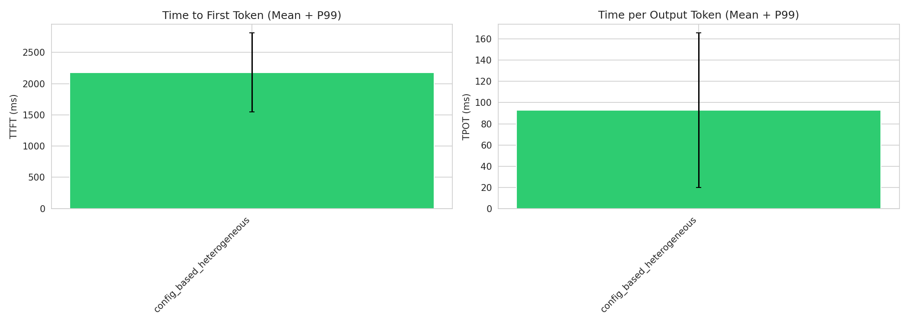
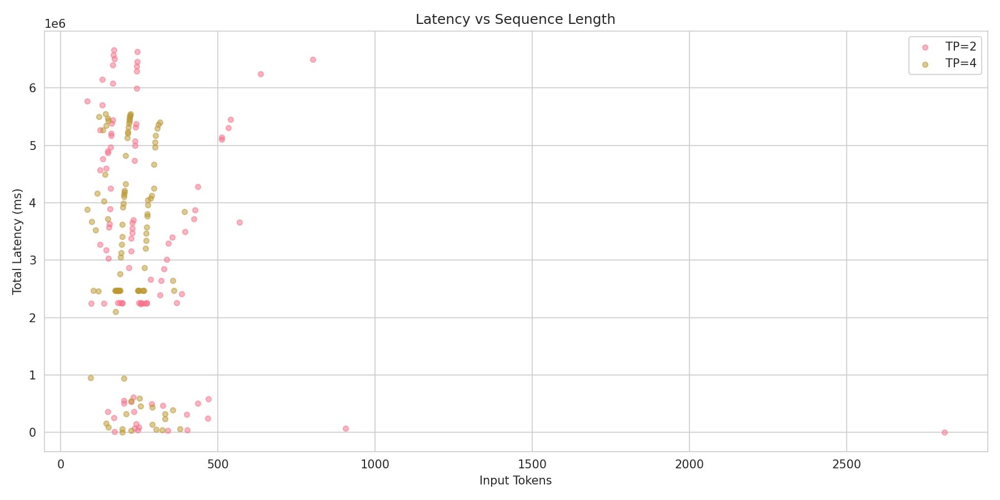
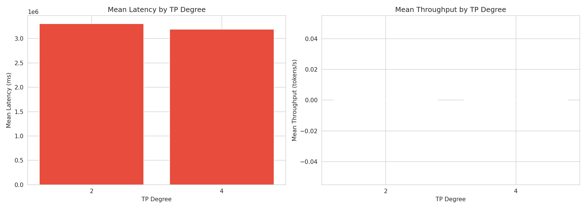

# Heterogeneous TP Configuration Benchmark Report

Generated: 2026-02-09 11:18:23

## Executive Summary

- **Best Throughput**: config_based_heterogeneous (968.34 tokens/s)
- **Best Latency**: config_based_heterogeneous (3247325.65 ms mean)
- **Total Scenarios Tested**: 1

## Detailed Results

### Performance Metrics by Scenario

| Scenario | Type | Throughput (tokens/s) | Latency Mean (ms) | P99 (ms) | TTFT (ms) | TPOT (ms) |
|----------|------|----------------------|-------------------|----------|-----------|-----------|
| config_based_heterogeneous | heterogeneous | 968.34 | 3247325.65 | 6574022.19 | 2178.59 | 92.79 |

## Scenario Comparisons

## Sequence Category Analysis

### config_based_heterogeneous

| Category | Count | Avg Input Tokens | Latency Mean (ms) | P99 (ms) |
|----------|-------|------------------|-------------------|----------|
| short | 27 | 360 | 2328244.67 | 5434257.89 |
| extra_long | 163 | 241 | 3461890.77 | 6593327.03 |
| medium | 8 | 266 | 1977459.51 | 4818532.64 |

## Visualizations

### Throughput Comparison

### Latency Comparison

### Latency Distribution

### TTFT and TPOT

### Sequence Length Analysis

### TP Degree Performance

## Conclusions

Based on the benchmark results:

1. **Best Throughput Configuration**: config_based_heterogeneous achieves 968.34 tokens/s

2. **Best Latency Configuration**: config_based_heterogeneous achieves 3247325.65 ms mean latency
