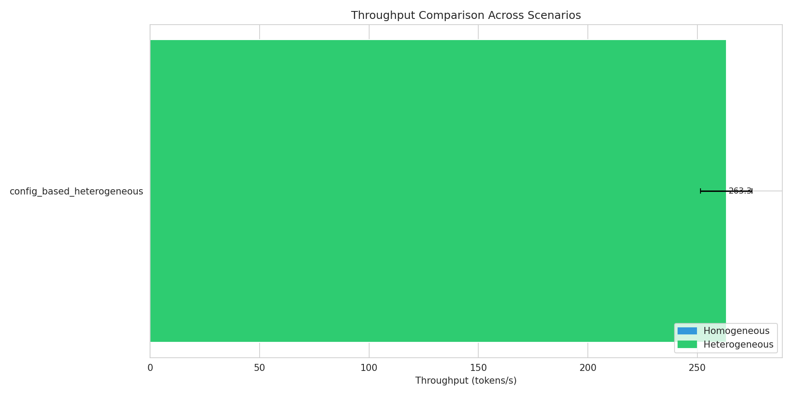
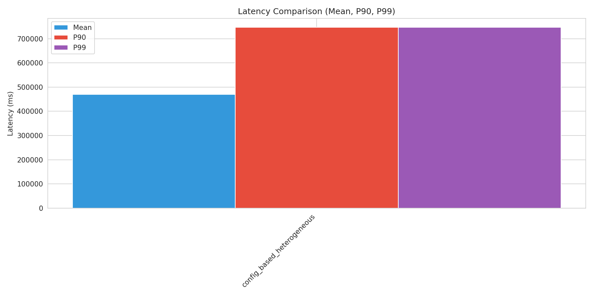
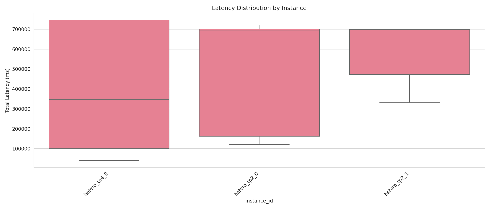
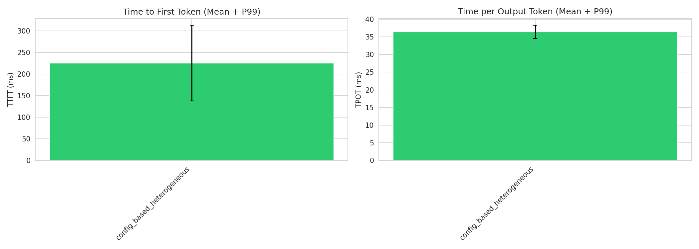
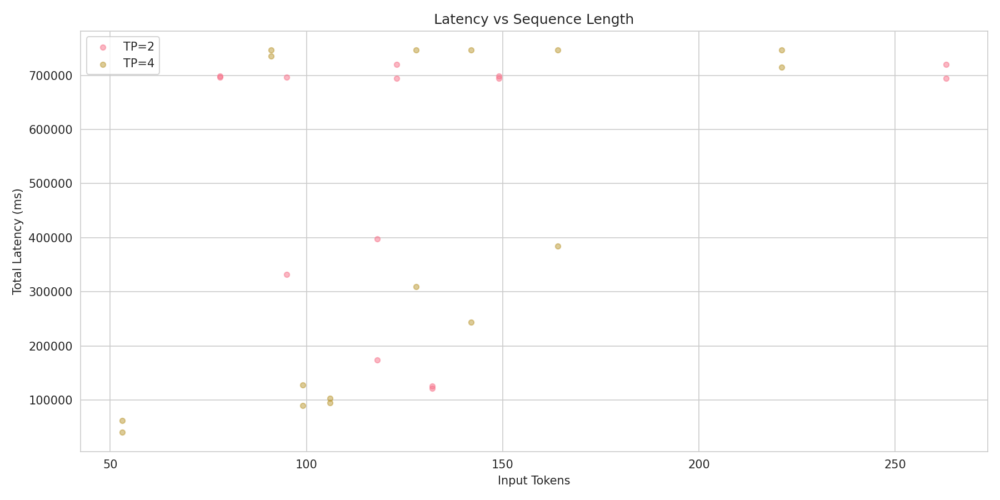
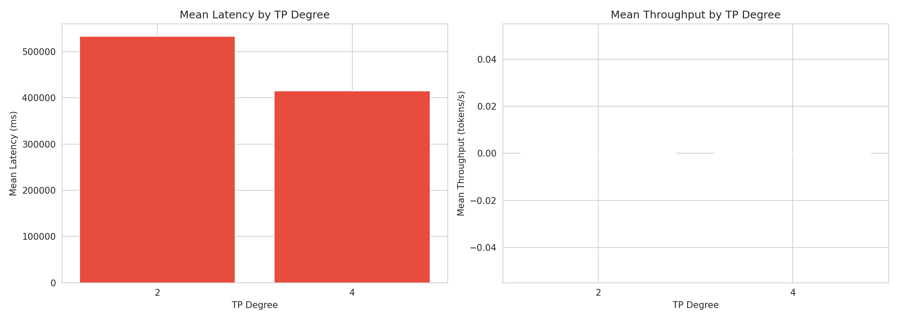

# Heterogeneous TP Configuration Benchmark Report

Generated: 2026-02-06 21:09:50

## Executive Summary

- **Best Throughput**: config_based_heterogeneous (263.26 tokens/s)
- **Best Latency**: config_based_heterogeneous (470286.32 ms mean)
- **Total Scenarios Tested**: 1

## Detailed Results

### Performance Metrics by Scenario

| Scenario | Type | Throughput (tokens/s) | Latency Mean (ms) | P99 (ms) | TTFT (ms) | TPOT (ms) |
|----------|------|----------------------|-------------------|----------|-----------|-----------|
| config_based_heterogeneous | heterogeneous | 263.26 | 470286.32 | 746366.94 | 225.50 | 36.42 |

## Scenario Comparisons

## Sequence Category Analysis

### config_based_heterogeneous

| Category | Count | Avg Input Tokens | Latency Mean (ms) | P99 (ms) |
|----------|-------|------------------|-------------------|----------|
| extra_long | 12 | 125 | 335572.71 | 746370.09 |
| medium | 8 | 107 | 510929.95 | 718929.91 |
| short | 6 | 177 | 563626.36 | 719481.52 |
| long | 4 | 128 | 653129.81 | 746347.62 |

## Visualizations

### Throughput Comparison

### Latency Comparison

### Latency Distribution

### TTFT and TPOT

### Sequence Length Analysis

### TP Degree Performance

## Conclusions

Based on the benchmark results:

1. **Best Throughput Configuration**: config_based_heterogeneous achieves 263.26 tokens/s

2. **Best Latency Configuration**: config_based_heterogeneous achieves 470286.32 ms mean latency
