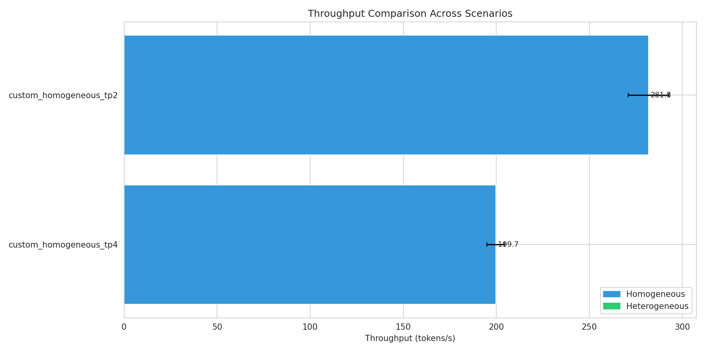
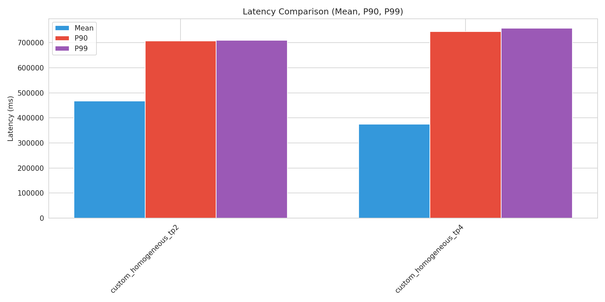
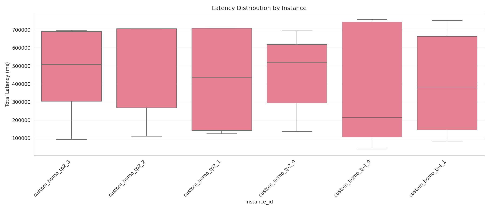
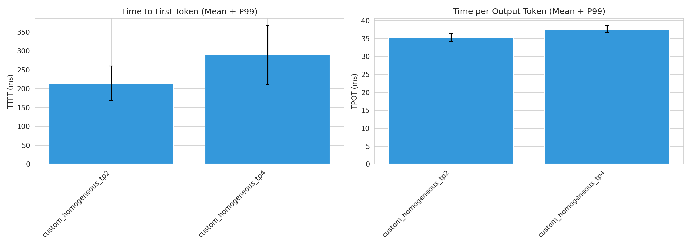
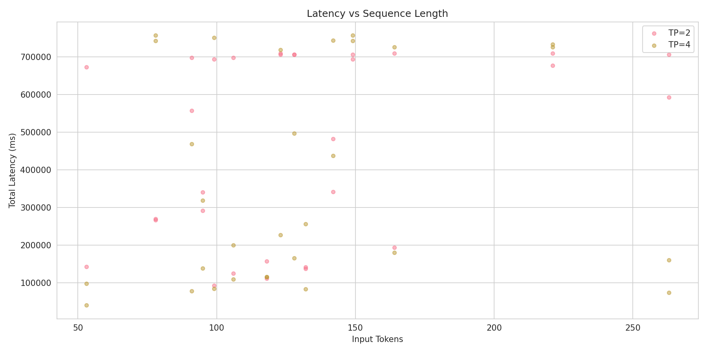
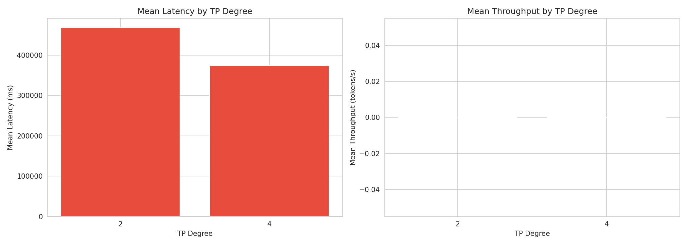

# Heterogeneous TP Configuration Benchmark Report

Generated: 2026-02-07 11:40:15

## Executive Summary

- **Best Throughput**: custom_homogeneous_tp2 (281.81 tokens/s)
- **Best Latency**: custom_homogeneous_tp4 (374830.84 ms mean)
- **Total Scenarios Tested**: 2

## Detailed Results

### Performance Metrics by Scenario

| Scenario | Type | Throughput (tokens/s) | Latency Mean (ms) | P99 (ms) | TTFT (ms) | TPOT (ms) |
|----------|------|----------------------|-------------------|----------|-----------|-----------|
| custom_homogeneous_tp2 | homogeneous | 281.81 | 467881.27 | 709637.26 | 214.60 | 35.30 |
| custom_homogeneous_tp4 | homogeneous | 199.72 | 374830.84 | 757229.90 | 289.45 | 37.64 |

## Scenario Comparisons

## Sequence Category Analysis

### custom_homogeneous_tp2

| Category | Count | Avg Input Tokens | Latency Mean (ms) | P99 (ms) |
|----------|-------|------------------|-------------------|----------|
| extra_long | 12 | 125 | 504041.60 | 709269.55 |
| short | 6 | 177 | 494563.33 | 706337.55 |
| medium | 8 | 107 | 357788.37 | 709411.58 |
| long | 4 | 128 | 539563.03 | 709260.51 |

### custom_homogeneous_tp4

| Category | Count | Avg Input Tokens | Latency Mean (ms) | P99 (ms) |
|----------|-------|------------------|-------------------|----------|
| long | 4 | 128 | 363202.96 | 718975.53 |
| medium | 8 | 107 | 405347.65 | 756258.19 |
| extra_long | 12 | 125 | 382073.71 | 750624.83 |
| short | 6 | 177 | 327407.92 | 756550.43 |

## Visualizations

### Throughput Comparison

### Latency Comparison

### Latency Distribution

### TTFT and TPOT

### Sequence Length Analysis

### TP Degree Performance

## Conclusions

Based on the benchmark results:

1. **Best Throughput Configuration**: custom_homogeneous_tp2 achieves 281.81 tokens/s

2. **Best Latency Configuration**: custom_homogeneous_tp4 achieves 374830.84 ms mean latency
