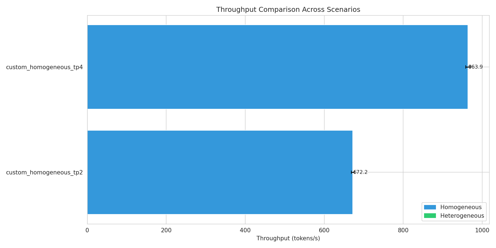
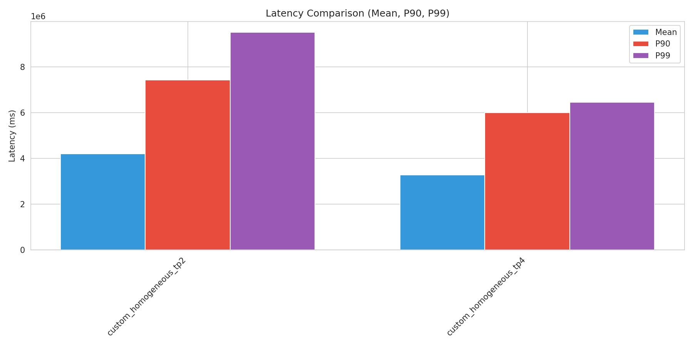
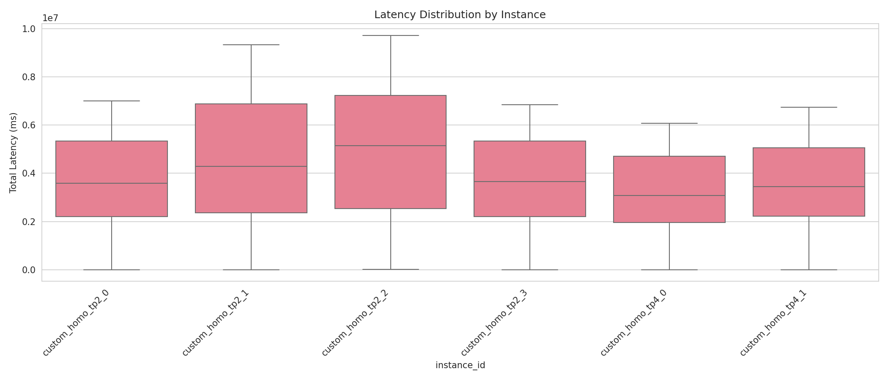
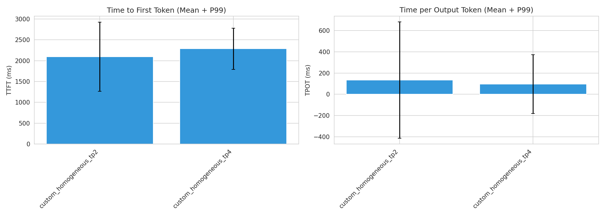
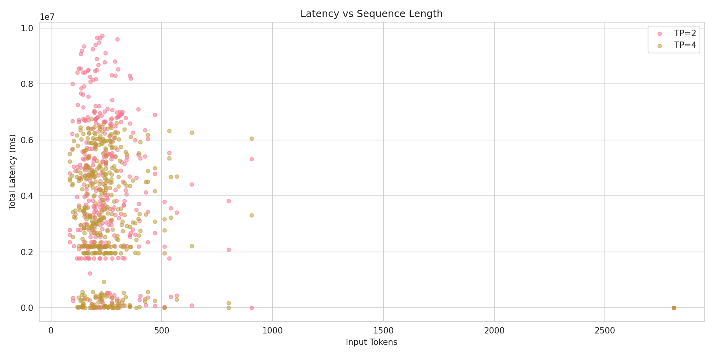
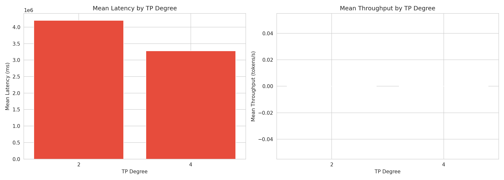

# Heterogeneous TP Configuration Benchmark Report

Generated: 2026-02-07 21:20:25

## Executive Summary

- **Best Throughput**: custom_homogeneous_tp4 (963.92 tokens/s)
- **Best Latency**: custom_homogeneous_tp4 (3277036.98 ms mean)
- **Total Scenarios Tested**: 2

## Detailed Results

### Performance Metrics by Scenario

| Scenario | Type | Throughput (tokens/s) | Latency Mean (ms) | P99 (ms) | TTFT (ms) | TPOT (ms) |
|----------|------|----------------------|-------------------|----------|-----------|-----------|
| custom_homogeneous_tp2 | homogeneous | 672.24 | 4204124.34 | 9499530.41 | 2091.56 | 133.47 |
| custom_homogeneous_tp4 | homogeneous | 963.92 | 3277036.98 | 6454562.94 | 2286.21 | 95.97 |

## Scenario Comparisons

## Sequence Category Analysis

### custom_homogeneous_tp2

| Category | Count | Avg Input Tokens | Latency Mean (ms) | P99 (ms) |
|----------|-------|------------------|-------------------|----------|
| short | 54 | 360 | 4123779.27 | 9333412.51 |
| extra_long | 321 | 242 | 4219056.01 | 9556778.55 |
| medium | 16 | 266 | 4175722.47 | 8377524.43 |

### custom_homogeneous_tp4

| Category | Count | Avg Input Tokens | Latency Mean (ms) | P99 (ms) |
|----------|-------|------------------|-------------------|----------|
| short | 54 | 360 | 3225997.15 | 6482852.63 |
| extra_long | 326 | 241 | 3326161.48 | 6450941.00 |
| medium | 16 | 266 | 2448384.75 | 6155488.81 |

## Visualizations

### Throughput Comparison

### Latency Comparison

### Latency Distribution

### TTFT and TPOT

### Sequence Length Analysis

### TP Degree Performance

## Conclusions

Based on the benchmark results:

1. **Best Throughput Configuration**: custom_homogeneous_tp4 achieves 963.92 tokens/s

2. **Best Latency Configuration**: custom_homogeneous_tp4 achieves 3277036.98 ms mean latency
