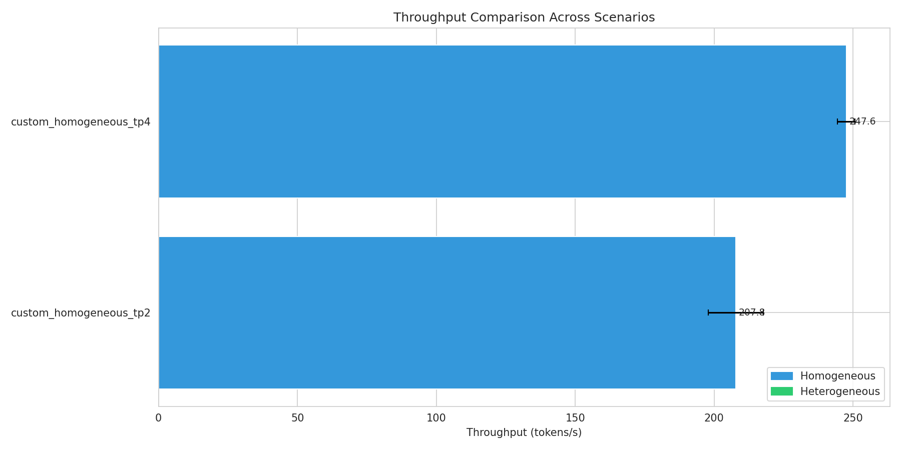
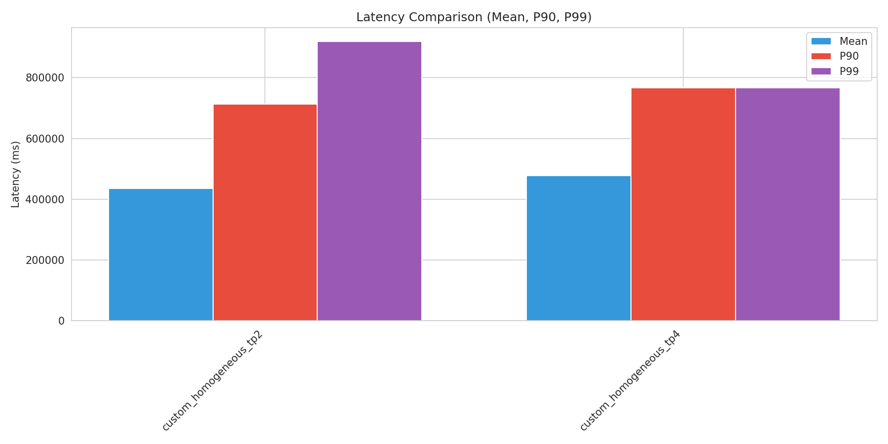
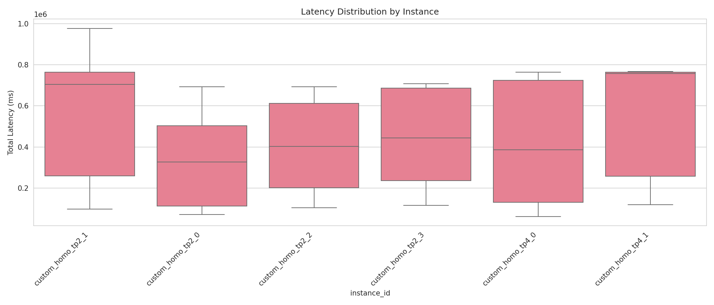
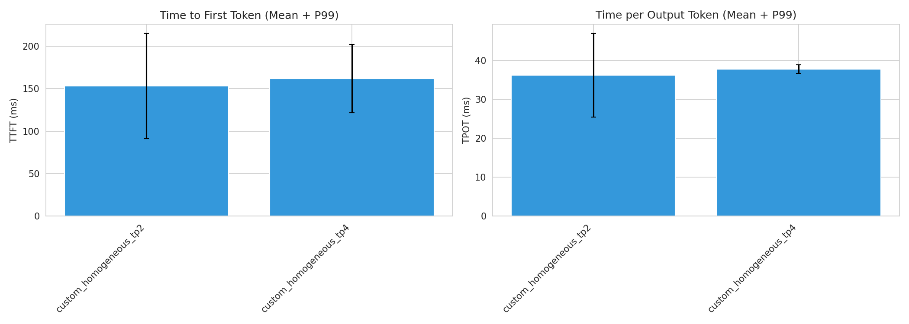
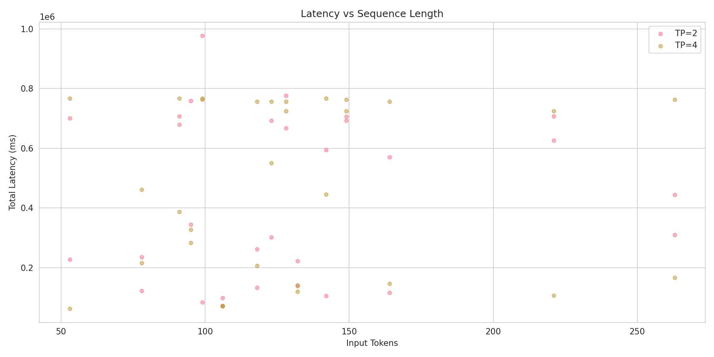
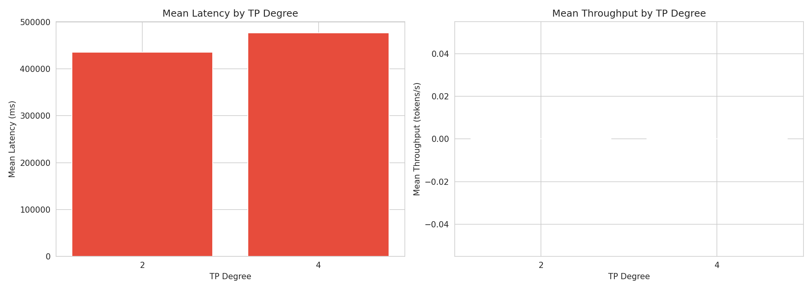

# Heterogeneous TP Configuration Benchmark Report

Generated: 2026-02-06 16:33:22

## Executive Summary

- **Best Throughput**: custom_homogeneous_tp4 (247.56 tokens/s)
- **Best Latency**: custom_homogeneous_tp2 (435859.96 ms mean)
- **Total Scenarios Tested**: 2

## Detailed Results

### Performance Metrics by Scenario

| Scenario | Type | Throughput (tokens/s) | Latency Mean (ms) | P99 (ms) | TTFT (ms) | TPOT (ms) |
|----------|------|----------------------|-------------------|----------|-----------|-----------|
| custom_homogeneous_tp2 | homogeneous | 207.83 | 435859.96 | 918505.67 | 153.29 | 36.20 |
| custom_homogeneous_tp4 | homogeneous | 247.56 | 477302.39 | 766780.10 | 161.87 | 37.79 |

## Scenario Comparisons

## Sequence Category Analysis

### custom_homogeneous_tp2

| Category | Count | Avg Input Tokens | Latency Mean (ms) | P99 (ms) |
|----------|-------|------------------|-------------------|----------|
| short | 30 | 131 | 435859.96 | 918505.67 |

### custom_homogeneous_tp4

| Category | Count | Avg Input Tokens | Latency Mean (ms) | P99 (ms) |
|----------|-------|------------------|-------------------|----------|
| short | 30 | 131 | 477302.39 | 766780.10 |

## Visualizations

### Throughput Comparison

### Latency Comparison

### Latency Distribution

### TTFT and TPOT

### Sequence Length Analysis

### TP Degree Performance

## Conclusions

Based on the benchmark results:

1. **Best Throughput Configuration**: custom_homogeneous_tp4 achieves 247.56 tokens/s

2. **Best Latency Configuration**: custom_homogeneous_tp2 achieves 435859.96 ms mean latency
